# cost-optim-slack-chatbot-genai-agent

## Introduction

The goal of this AWS Slack based Chatbot is to provide answers to AWS Cost Optimization questions, and provide links to Cost Optim QuickSight Dashboards (prerequisite: you need to install [CID](https://catalog.workshops.aws/awscid/en-US/dashboards/foundational/cudos-cid-kpi) Dashboards) that will help understand the answers.
The Chatbot is based on Slack, interfaced with a Bedrock Claude [Agent](https://aws.amazon.com/bedrock/agents/), and uses a [KnowledgeBase](https://aws.amazon.com/bedrock/knowledge-bases/) customized using [CFM Tips](https://catalog.workshops.aws/awscff/en-US) specialized Cost Optim content.

The following instructions will help you create a Slack bot and install 2 CloudFormation templates with the following components (see below Architecture diagram):
- Amazon OpenSearch Serverless Vector Database for storing the Amazon Titan Text Embeddings v2 embeddings
- API Gateway to interface with the Slack bot
- Lambdas triggered by the API Gateway and by the Bedrock Agent to retrieve the QuickSight Dashboard URL
- Bedrock Agent (Anthropic Claude)
- Bedrock KnowledgeBase (Amazon Titan Text Embeddings v2) - uses a web crawler to crawl the [CFM Tips](https://catalog.workshops.aws/awscff/en-US) web pages
- IAM Roles & Policies

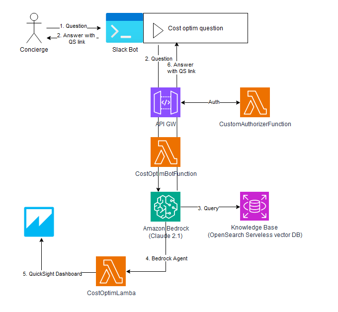

# Deployment of the Solution

## Pre requisites

**You need to use a region where Anthropic Claude and Amazon Titan Embeddings v2.0 is deployed, as in us-east-1 and us-west-2 for instance**

The first step is to check you have enabled the Bedrock models that you are going to use.
For that, just go to the Bedrock configurations - Model access page in the AWS Console of your account, and request model access to all Anthropic Claude and Amazon Titan Text Embeddings v2 models at the minimum.

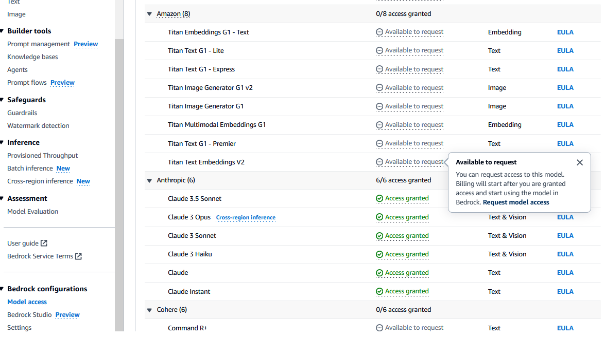

You also need to install [Cudos v5](https://catalog.workshops.aws/awscid/en-US/dashboards/foundational/cudos-cid-kpi) Quicksight Dashboard

## Create a Slack App

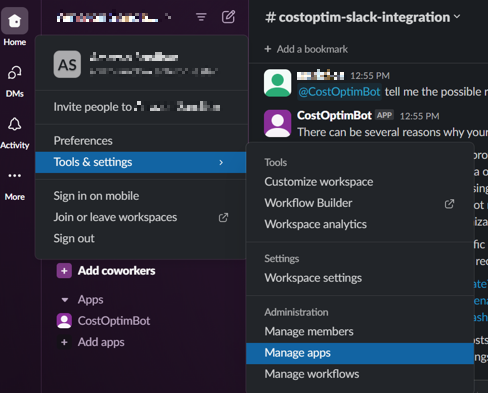

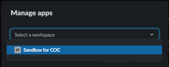

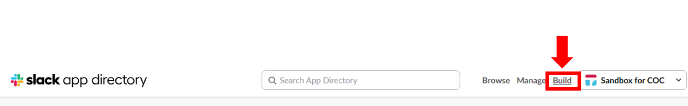

Adapt and use this [manifest](https://github.com/aws-samples/slack-app-integration-with-bedrock-agent/blob/main/slack-app/manifest.yml)

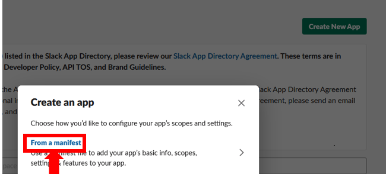

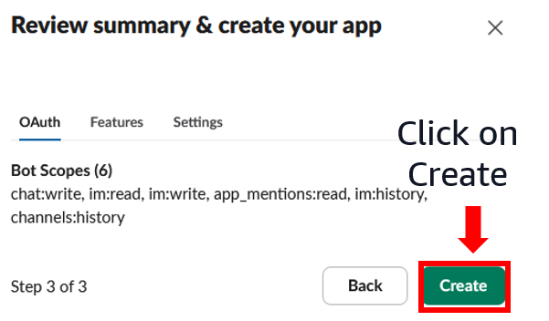

## Get Oauth Token

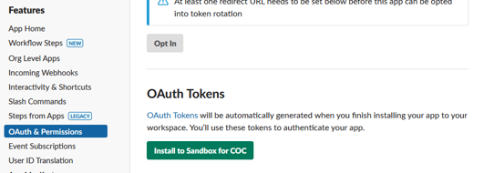

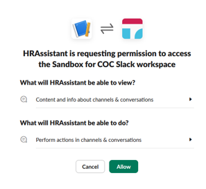

Copy the token and keep it for later.

On your AWS Console, for security reason, manually create a new Secret in Secret Manager called SlackToken.
Use as an input:
- Secret Type = Other Type (token...)
- Key = "token"
- Value = value of the Slack token that you previously copied
- Keep the default Encryption Key
- SecretName = "SlackToken"

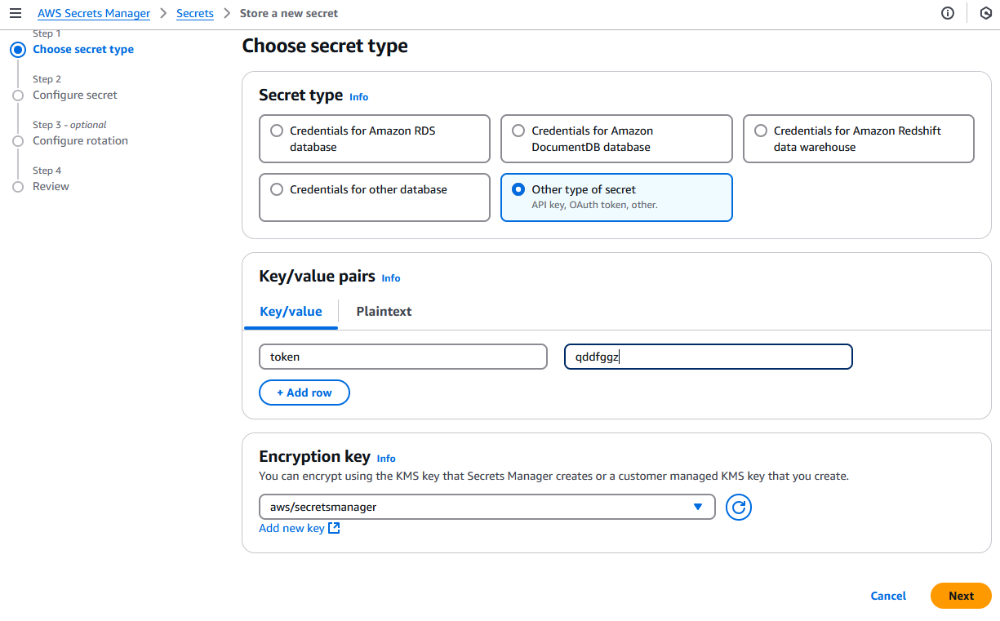
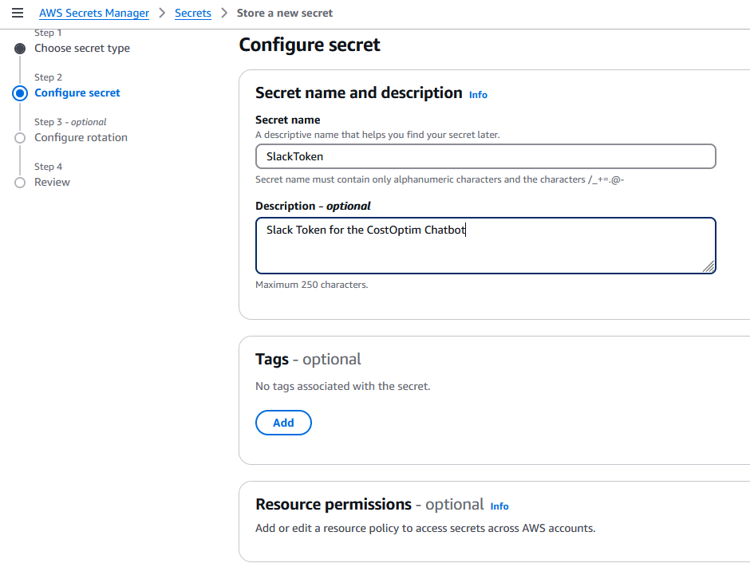

## Deploy OpenSearch Serverless with CloudFormation

Get the code on your dev environment: 
>git clone git@ssh.gitlab.aws.dev:merichea/CostOptimChatbot.git

Install the [SAM CLI](https://docs.aws.amazon.com/serverless-application-model/latest/developerguide/install-sam-cli.html) and [python12](https://www.python.org/downloads/release/python-3128/) if needed.

Assume the developer role on your dev environment (change paramerters in **Bold** in the command below):
>aws sts assume-role --role-arn arn:aws:iam::**AccountId**:role/**devopsrole** --role-session-name "devopsrole"

Create a SAM stack using the OpenSearchDB.yml template - change paramerters in **Bold** in the command below.
Use as an input the arn of the developer role you are using to launch the template.
>cd cfn-templates
>
>sam deploy  --guided --stack-name AOSS  --region us-east-1 \ \
 --capabilities CAPABILITY_NAMED_IAM  --parameter-overrides \ \
 IAMUserArn=arn:aws:iam::**AccountId**:role/**devopsrole** \ \
 --template ./OpenSearchDB.yml

Once the Cloudformation stack creation is successful navigate to the Output section of the stack and grab the following output values AmazonBedrockExecutionRoleForKnowledgeBase and CollectionARN

## Deploy the rest of the architecture (APIGW, Lambdas, Bedrock Agent, KnowledgeBase, Roles...)

Create a SAM stack using the CostOptimChatbot.yml template - change paramerters in **Bold** in the command below.
Use as an input:
- the AmazonBedrockExecutionRoleForKnowledgeBase arn from the output of the OpenSearch stack
- the CollectionArn arn from the output of the OpenSearch stack
- the desired region

>sam deploy  --guided --stack-name COC  --region us-east-1 \ \
--capabilities CAPABILITY_NAMED_IAM  --parameter-overrides \ \
AmazonBedrockExecutionRoleForKnowledgeBasearn=arn:aws:iam::**AccountId**:role/AmazonBedrockExecutionRoleForKnowledgeBase-aosscollection \ \
CollectionARN=arn:aws:aoss:us-east-1:**AccountId**:collection/**Collection ID** \ \
Region=us-east-1 --template ./CostOptimChatbot.yml

Get the APIGW url from the output of the SAM Stack.

## Run the Crawler to sync the KnowledgeBase

Manually run the Web Crawler to sync the KnowledgeBase with the content from the [CFM Tips](https://catalog.workshops.aws/awscff/en-US)

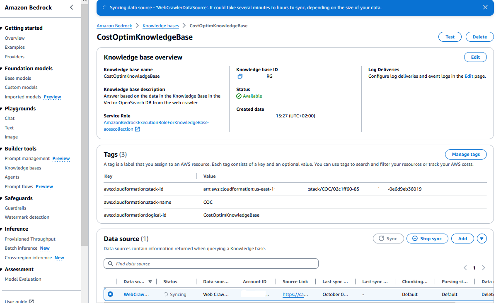

## Use CFN ApiUrl Output in the Slack Event Subs

Update the Slack Event Subscription with the ApiGW Url from the Output of the CloudFormation template

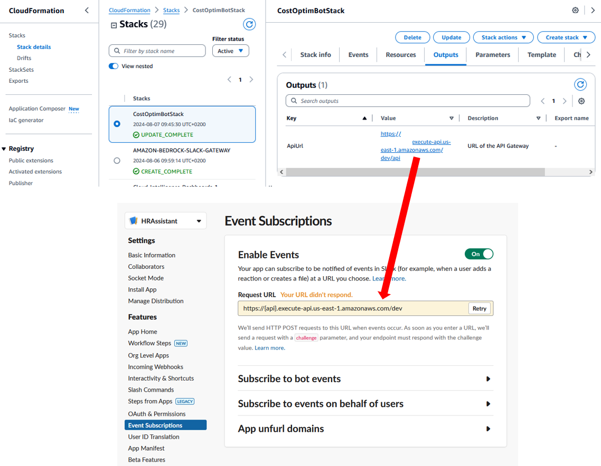

## Use the Slack CostOptim Chatbot

You can now use your Slack app to ask questions to the Chatbot.

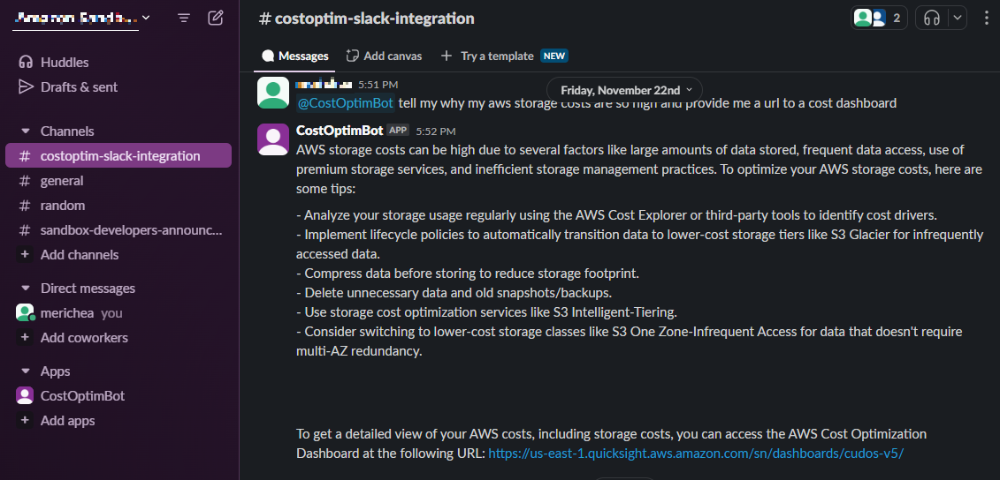

## Uninstall

>aws cloudformation delete-stack --stack-name COC \
aws cloudformation delete-stack --stack-name AOSS

# Credits

This project is based on the following public AWS Samples:
- [amazon-bedrock-rag-knowledgebases-agents-cloudformation](https://github.com/aws-samples/amazon-bedrock-rag-knowledgebases-agents-cloudformation)
- [slack-app-integration-with-bedrock-agent](https://github.com/aws-samples/slack-app-integration-with-bedrock-agent)
- [amazon-bedrock-agents-cancer-biomarker-discovery](https://github.com/aws-samples/amazon-bedrock-agents-cancer-biomarker-discovery/)
- [contact-center-genai-agent](https://github.com/aws-samples/contact-center-genai-agent/)
